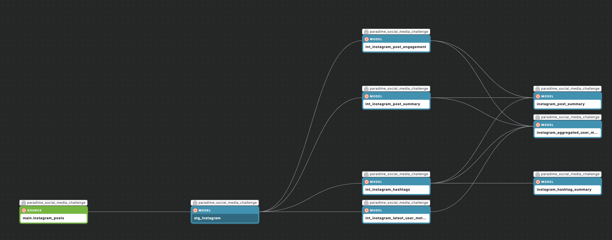
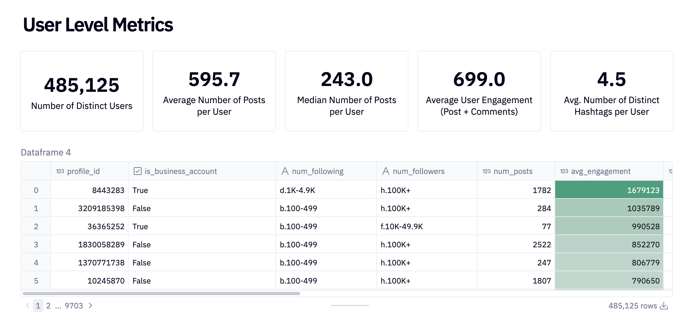
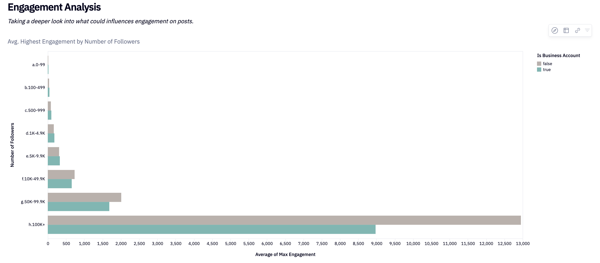
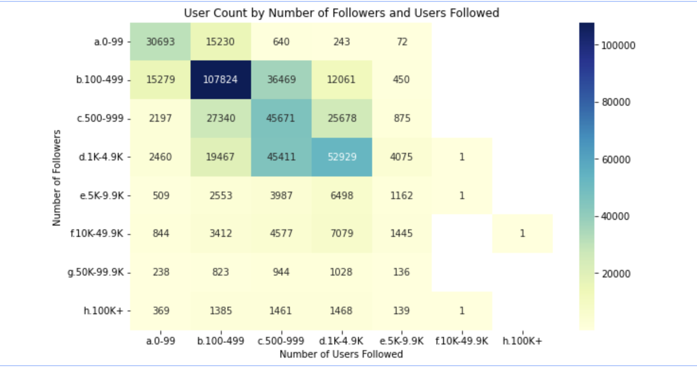
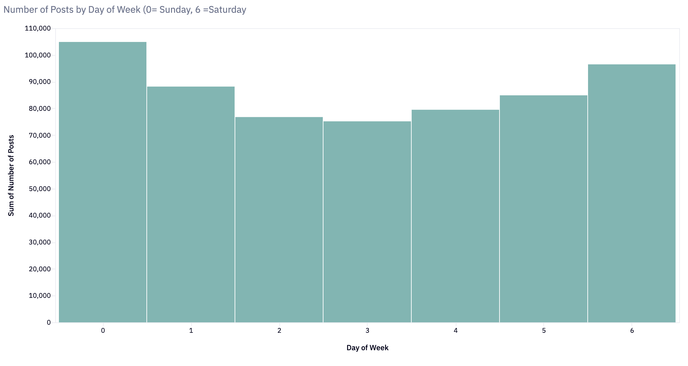
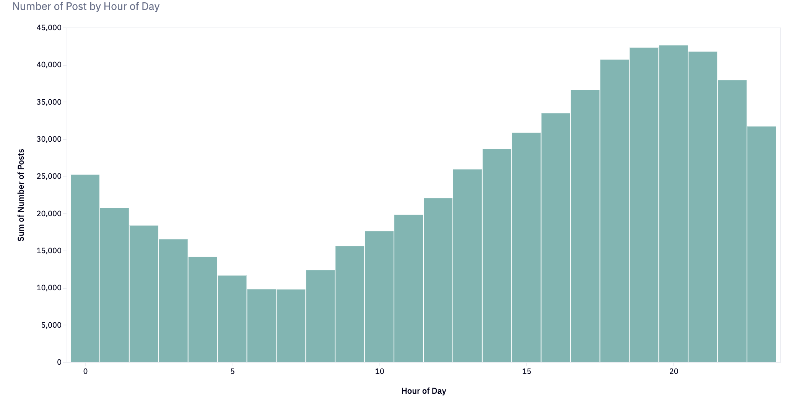
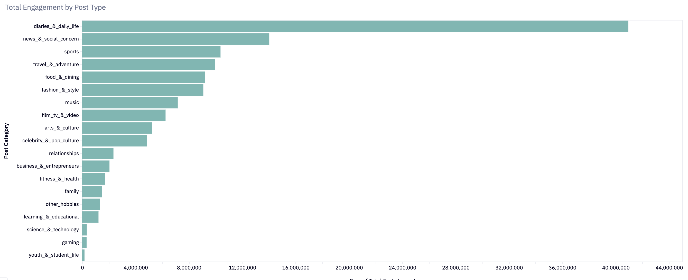
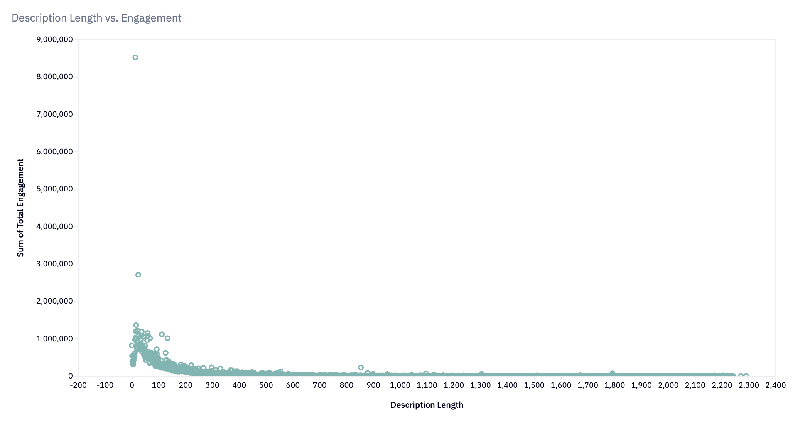
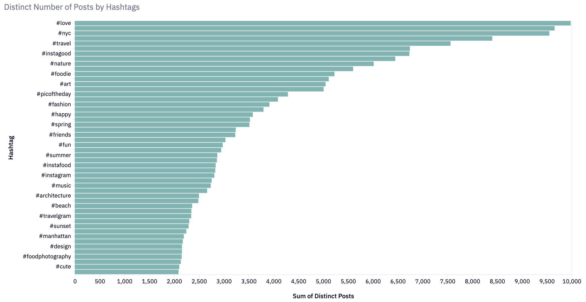

# dbt™ Data Modeling Challenge - Social Media Edition
# Instagram Post Engegament Analysis
Created by [Alex Vajda](https://www.linkedin.com/in/alexandra-vajda)

## Table of Contents
1. [Introduction](#introduction)
2. [Data Source & Data Lineage](#data-source--data-lineage)
3. [Methodology](#methodology)
4. [Insights](#insights)
5. [Conclusions](#conclusions)

### Introduction 👋
This project focuses on analysing user engagement metrics on Instagram using a dataset of posts and user information. The analysis aims to uncover insights into how different factors—such as the number of followers, following, and hashtags—affect engagement levels across various types of content.
The project involves building a series of data models using dbt, integrating user and post-level data, and visualising key engagement trends. The final analysis provides a comprehensive overview of user behaviour, post characteristics, and engagement patterns.

## Data Source & Data Lineage 📈

### Data Source 🍯
Dataset containing 600,000 Instagram posts between 2012 and 2019 from HuggingFace. [Source](https://huggingface.co/datasets/vargr/main_instagram)

### Staging 🎭
- `stg_instagram` where basic column transformations are applied to prepare data for downstream modelling.

### Intermediate 🪜
- `int_instagram_hashtags` model prepared for hashtag analysis and also the stage where hashtags are extacted from the post descrption.
- `int_instagram_latest_user_metrics` user specific columns are selected and using QUALIFY taking the latest snapshot of profile metrics (by post date).
- `int_instagram_post_engagement` post specific engagement metrics selected to prepare for final model, further features are added to enhance analysis at later steps.
- `int_instagram_post_summary` post specific features (not related to engagement) such as date and time of posting etc.

### Mart 🛒
- `instagram_aggregated_user_metrics` aggregates Instagram user metrics and post engagement data to provide a comprehensive view of user profiles and their engagement statistics. Includes average, maximum, and minimum engagement metrics, as well as summary statistics for posts and hashtag usage. Grain is a single user per row.
- `instagram_post_summary` post-level metrics combining engagement, summary, and hashtag data for each Instagram post.
- `instagram_hashtag_summary` post-hashtag level model that support hashtag analysis.

### Macros 🪛
- `extract_hashtags` uses REGEX to extract hashtags from the post captions.
- `group_follower_counts` to help writing DRY code for follower groupings.

### Lineage ⛓️

## Methodology 📐
### Tools Used
- [**Paradime:**](https://www.paradime.io/) SQL and dbt™ development
- [**MotherDuck:**](https://motherduck.com/) Data storage and computing
- [**Hex:**](https://hex.tech/) Data visualisation
- **ChatGPT** for ideation
- **dbt testing** for data accuracy
- **dbt utils package** for testing assertions

### Applied Techniques 👩‍🍳
#### Data Sourcing
Sourcing relevant data was by far the most challenging aspect of this project. Social media platforms are notoriously difficult to scrape due to strict API limits and data access restrictions. Fortunately, HuggingFace's vast collection of pre-sourced social media datasets came to the rescue. While these datasets provided a helpful starting point, they had limitations—particularly around the unpredictability of content and the sample size needed to extract actionable insights. Despite these hurdles, I made careful selections to align the data with the project goals.

#### Data Preparation 🪄
Since the sourced data was already in relatively good shape, only minor transformations were required at the staging layer. These transformations were aimed at standardising fields and preparing the dataset for more advanced analysis. To enhance the dataset, new features were engineered that could surface meaningful trends and provide deeper insights in the later stages.

To keep things structured, models were layered on top of the staging data. This approach allowed for a clear separation between key features (such as engagement metrics) and computed metrics, ensuring modularity and flexibility throughout the project.

#### Feature Engineering & Final Model Creation 🎉
At the later stages, I focused on building additional models that could provide deeper insights into user and post-level behaviors. For the user-level analysis, metrics were aggregated such as follower count, engagement rates, and posting habits, creating an enriched profile for each user. This model was instrumental in understanding broader patterns and trends within our dataset.

For *post-level analysis*, a separate final model was created that zeroed in on individual posts, analysing content types, hashtags, and engagement metrics. This model helped us compare how different content formats (like images vs. videos) performed across the platform.

#### Visualisation & Insights 📊
The final dataset was imported into Hex for visualisation. Interactive dashboards were built to allow exploration of key metrics, such as average engagement by post type, most frequent posting times, and hashtag trends. These visualisations provided valuable insights into the factors driving engagement on social media, with clear takeaways about optimal content strategies.

## Insights
[**Dashboard Link**](https://app.hex.tech/52941720-d1c9-44bf-a2ec-e05eec443937/hex/fe651505-5b5f-40de-a909-2d06c74fd07c/draft/logic?view=app&dialog=preview)

#### User-Level Metrics Summary:
Our dataset consists of 485,125 distinct users, with an average of 595.72 and a median of 243 posts per user. On average, each user generates 699 engagements per post, which includes likes and comments. Additionally, users utilise an average of 4.49 distinct hashtags in their posts, highlighting a moderate level of hashtag diversity.

#### Business Accounts
In terms of business versus non-business accounts, 35% of the profiles analysed are business accounts, with the majority (65%) being personal profiles. This distinction could play a significant role in understanding posting behaviour and engagement differences.

#### Follower Count Distribution
When categorising users by their follower count, we observe that the majority fall within the 100-499 followers range, followed by 500-999 and 1,000-4,999 followers. This suggests that most users have modest-sized followings, with fewer users having larger audiences. Interestingly, very few users exceed 50K followers, which points to a minority of high-profile accounts in the dataset.

#### Number of Followers and Engegament (and business accounts)

- It doesn't seem surprising that as the number of followers increase, so does engagement. Non-business account with high follower count (over 100k) tend to have slightly lower engagement compared to non-business accounts, however these findigs are skewed since the data contains more non-business users.

#### Number of Followers and Users Followed

- There's a strong concentration of users in the lower bands, with majority of users sitting between having 100-5k followers  and following between 100-5k followers.
- There are very few influencers, i.e. where the number of followers is over 50k and these users will also have a lower numbr of users they follow.

- Most posts are shared in the evening hours, with a steady increase in posting activity starting from 8 AM and peaking at 8 PM.
- The busiest days for posting are Sunday (0) and Monday, with Wednesday being the least popular day for posts.

- There seems to be a small plateu when analysing the relationship between the lenght of the description and the total engagement received on the post.

#### Top Hashtags in the dataset

- The most popular hashtag in the dataset during the analysed period was #love, followed by #nyc and travel.

## Conclusions
The analysis of the Instagram dataset offers a thorough overview of user behaviours, content trends, and engagement patterns. With a focus on 485,125 distinct users, we've observed that the average user posts around 595 times and generates substantial engagement per post, with an average of 699 engagements. The moderate use of hashtags (4.49 per post) reflects a diverse yet controlled approach to content categorisation.

The distinction between business and personal accounts reveals that while 35% of profiles are business-related, the majority are personal accounts. This distinction is crucial for understanding variations in posting behaviour and engagement metrics.

Follower count distribution indicates that most users have modest followings, with a significant drop-off in users with larger audiences. This highlights a generally balanced user base, with only a few high-profile accounts standing out. Notably, as follower counts increase, so does engagement, though non-business accounts with very high follower counts exhibit slightly lower engagement levels, likely due to the skewed distribution of non-business users in the data.

The analysis also shows that most users are concentrated in the lower bands for both followers and following counts, with very few influencers (users with over 50k followers). Influencers tend to follow fewer accounts, indicating a more selective approach to their network.

Posting patterns reveal that evening hours, particularly around 8 PM, are the most active times for users, with a notable peak in posting activity. Sundays and Mondays are the busiest days for posts, while Wednesdays are less popular.

In terms of content length, there is a slight plateau in engagement relative to the length of post descriptions, suggesting that extremely long or short descriptions do not significantly impact overall engagement.

Finally, hashtag analysis shows that #love, #nyc, and #travel are the most popular hashtags, reflecting common themes and interests within the dataset.

Overall, these insights provide some guidance for optimising content strategies and understanding user dynamics on Instagram.

